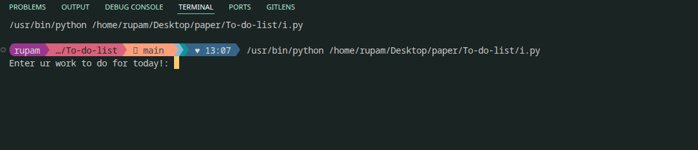
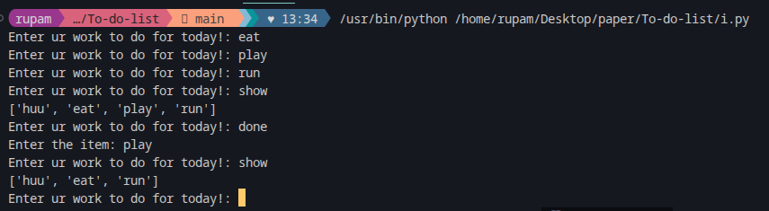

   

-
**Hello Everybody!**
-
*My new project is out now!*

-
This is a simple To-do List Program made using python.
This is entirely my alogrithm and logic and even the code.
--

Screenshots

--

The commands are :
  
**1. show**
  
**2. done**

and type **bye** to exit 

   
--
Demo
 

--

**Strictly type these only!**

 

**Made on    Computer**
